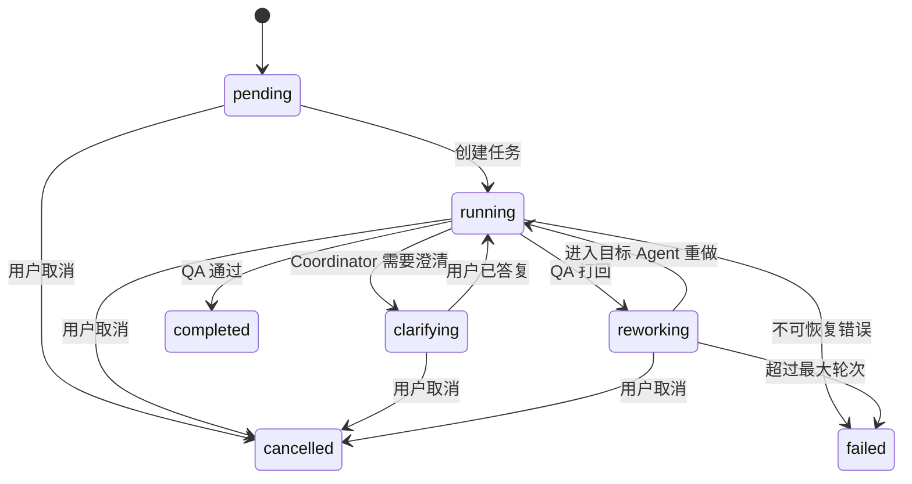

# 工作流状态机与打回路由设计

## 1. 文档目标

本文档定义 CompeteAI 多 Agent 流程中的任务状态机、Agent 执行状态、QA 打回规则、澄清循环和终止条件，用于指导 `internal/workflow` 目录的实现。

这份设计的重点是先把“流程怎么走”定义清楚，再去实现执行器、Kafka Router 和 SSE 推送。

---

## 2. 落位目录

建议新增目录：

```text
internal/
├── workflow/
│   ├── engine.go
│   ├── router.go
│   └── state.go
```

建议职责：

- `engine.go`
  - 流程执行入口
- `router.go`
  - 根据 QA 打回和消息类型决定下一跳
- `state.go`
  - 状态机定义与状态转换校验

---

## 3. 工作流设计目标

需要同时满足：

1. 任务能从创建走到完成
2. QA 不通过时能局部重做
3. 用户输入不足时能澄清后继续
4. 每一步状态都能驱动 Task、Trace、SSE、前端展示

---

## 4. 顶层任务状态机

建议继续使用并扩展现有 `domain.TaskStatus` 语义，目标状态如下：

```text
pending
running
clarifying
reworking
completed
failed
cancelled
```

说明：

- `pending`
  - 任务已创建，尚未进入执行
- `running`
  - 正常主流程执行中
- `clarifying`
  - 等待用户补充信息
- `reworking`
  - QA 打回后局部重做中
- `completed`
  - 流程完成且 QA 通过
- `failed`
  - 执行失败，且无法恢复
- `cancelled`
  - 用户主动取消

---

## 5. Agent 执行状态机

建议继续沿用现有 `domain.AgentRunStatus` 语义：

```text
pending
running
completed
failed
rejected
```

含义：

- `pending`
  - 尚未进入该 Agent
- `running`
  - 正在处理
- `completed`
  - 当前轮次处理成功
- `failed`
  - 当前轮次失败
- `rejected`
  - 被 QA 判定需要重做

---

## 6. 主流程状态流转

标准主流程如下：

```text
Task Created
  -> Coordinator
  -> Collector
  -> Analyst
  -> Writer
  -> QA
  -> Completed
```

对应任务状态变化：

```text
pending -> running -> completed
```

对应 Agent 状态变化：

```text
coordinator: pending -> running -> completed
collector:   pending -> running -> completed
analyst:     pending -> running -> completed
writer:      pending -> running -> completed
qa:          pending -> running -> completed
```

---

## 7. 澄清流程

若 Coordinator 判断信息不足，进入澄清循环：

```text
pending
  -> running
  -> clarifying
  -> running
  -> collector ...
```

典型触发条件：

- 竞品列表不明确
- 分析维度过于模糊
- 需要用户指定重点产品或市场范围

### 7.1 澄清流程步骤

1. Coordinator 读取任务输入
2. 判断缺少关键信息
3. 任务状态切换为 `clarifying`
4. 写入澄清问题到 Blackboard
5. 前端通过 API 或 SSE 展示问题
6. 用户提交答案
7. 答案写回 Blackboard
8. Coordinator 重新运行
9. 若条件满足，任务回到 `running`

---

## 8. QA 打回流程

QA 是工作流中唯一拥有“拒绝当前产出”能力的 Agent。

### 8.1 基本流程

```text
Writer -> QA
QA Reject
  -> Router / Coordinator
  -> targetAgent
  -> ... 再流回 QA
```

任务状态变化：

```text
running -> reworking -> completed
```

或：

```text
running -> reworking -> failed
```

---

## 9. QA 打回规则表

建议初版使用固定规则，不依赖复杂学习策略。

| QA 发现的问题 | 目标 Agent | 原因 |
|---|---|---|
| 来源不足、无可溯源引用 | `collector` | 需要补采或补来源 |
| SWOT/功能矩阵/定价缺项 | `analyst` | 需要补分析结构 |
| 报告章节不完整、摘要差 | `writer` | 需要重写报告组织 |
| 任务目标本身不明确 | `coordinator` | 需要重新拆解或请求澄清 |

推荐初版不要让 QA 直接打回多个目标 Agent，而是始终只选一个主目标，由 Coordinator 控制路由。

---

## 10. 打回消息结构

QA 打回时建议写入：

```text
qa.result = reject
qa.target_agent = analyst
qa.reason = SWOT 缺少第二个竞品的 weaknesses
qa.issues = [...]
```

同时生成协议消息：

```text
message_type = qa_reject
from_agent   = qa
to_agent     = coordinator
status       = rejected
```

Coordinator 或 Router 再将其转译为新的阶段触发。

---

## 11. 路由器职责

`internal/workflow/router.go` 应只做一件事：**根据当前消息和工作流状态，决定下一跳 Agent 或终止结果。**

建议 Router 输入：

- 当前 `MessageEnvelope`
- 当前 `WorkflowState`
- 当前 `QAResult`（若有）

建议 Router 输出：

- 下一跳 Agent
- 任务新状态
- 是否结束流程

---

## 12. Router 规则

## 12.1 正常主流程

| 当前 Agent | 下一跳 |
|---|---|
| `coordinator` | `collector` |
| `collector` | `analyst` |
| `analyst` | `writer` |
| `writer` | `qa` |
| `qa` | `completed` 或 `reworking` |

---

## 12.2 QA 打回路由

| `qa.target_agent` | 路由结果 |
|---|---|
| `collector` | 下一跳 `collector` |
| `analyst` | 下一跳 `analyst` |
| `writer` | 下一跳 `writer` |
| `coordinator` | 下一跳 `coordinator` |

当路由到目标 Agent 时，Router 应同时做：

1. `workflow.round += 1`
2. `workflow.rejection_count += 1`
3. `task.status = reworking`
4. 将 `qa.reason` 与 `qa.issues` 写入 `workflow.rework`

---

## 13. 终止条件

工作流应在以下情况终止：

### 13.1 成功终止

- QA 返回 `pass`
- 报告成功落库
- Task 状态更新为 `completed`

### 13.2 失败终止

- 某 Agent 返回不可恢复错误
- QA 打回次数超过 `maxRounds`
- 关键依赖长期不可用
- 任务数据损坏，无法继续

### 13.3 取消终止

- 用户主动取消任务

---

## 14. 轮次控制

建议工作流状态中固定：

- `round`
- `maxRounds`

默认策略建议：

- `round` 初始值为 `1`
- `maxRounds` 初始值可设为 `3`

含义：

- 第 1 轮是正常执行
- 第 2、3 轮用于 QA 打回后的重做
- 超出后直接标记任务失败，避免无穷循环

---

## 15. 状态转换校验

建议在 `internal/workflow/state.go` 里明确哪些状态转换合法。

## 15.1 TaskStatus 合法转换

| 当前状态 | 可转移到 |
|---|---|
| `pending` | `running`, `cancelled` |
| `running` | `clarifying`, `reworking`, `completed`, `failed`, `cancelled` |
| `clarifying` | `running`, `failed`, `cancelled` |
| `reworking` | `running`, `completed`, `failed`, `cancelled` |
| `completed` | 无 |
| `failed` | 无 |
| `cancelled` | 无 |

建议实现中显式校验，不允许任意状态互跳。

---

## 16. Agent 状态更新建议

每轮执行时，建议按以下规则更新 `task.AgentStates`：

### 进入某 Agent 前

- 当前 Agent 状态设为 `running`
- 写 `startedAt`
- 更新 `message`

### 成功完成后

- 当前 Agent 状态设为 `completed`
- 写 `finishedAt`

### 被 QA 打回时

- 被打回的目标 Agent 状态改为 `rejected`
- 后续重跑时再重新置为 `running`

### 失败时

- 当前 Agent 状态设为 `failed`

---

## 17. 与 Trace 的联动

状态机中的每个关键转移都应写入 Trace：

| 事件 | 建议 Trace 标签 |
|---|---|
| 任务创建 | `task_created` |
| Coordinator 开始 | `coordinator_started` |
| Collector 完成 | `collector_completed` |
| QA 打回 | `qa_rejected` |
| 路由重做 | `workflow_reworked` |
| 任务完成 | `task_completed` |

这能直接支撑：

- `TraceView`
- 流程回放
- 错误定位

---

## 18. 与前端的联动

状态机应成为前端展示的单一事实来源。

### Dashboard 关心

- `task.status`
- `task.progress`
- `agentStates`

### ReportView 关心

- 是否 `completed`
- `report.final` 是否可读取

### TraceView 关心

- 各轮次状态转移
- QA 打回次数
- 每个 Agent 的执行节点

### SSE 关心

- 任务状态变化
- Agent 状态变化
- 澄清请求
- QA 打回事件

---

## 19. 与现有仓库的迁移建议

当前仓库已有：

- `internal/service/analysis_service.go`
- `internal/domain/analysis.go`
- `internal/web/task.go`

建议迁移顺序：

1. 先抽离 `workflow engine`
2. 让 `TaskService.Create` 不再直接依赖单体 `AnalysisService`
3. 改由 `WorkflowEngine.Start(taskID)` 启动流程
4. `AnalysisService` 的逻辑拆到各个 Agent 中

这样状态机才真正成为系统的主控制器。

---

## 20. Mermaid 草图

可以直接将下面这张图放进后续架构文档或 README：



---

## 21. 本文档产出的直接结论

实现时应保证：

1. 任务状态机与 Agent 状态机分开建模
2. 主流程和 QA 打回流程都可显式表达
3. 打回只触发局部重做，不重跑整条链
4. 所有状态转移都能驱动 Task、Trace、SSE、前端展示
5. `round` 与 `maxRounds` 必须存在，避免死循环
